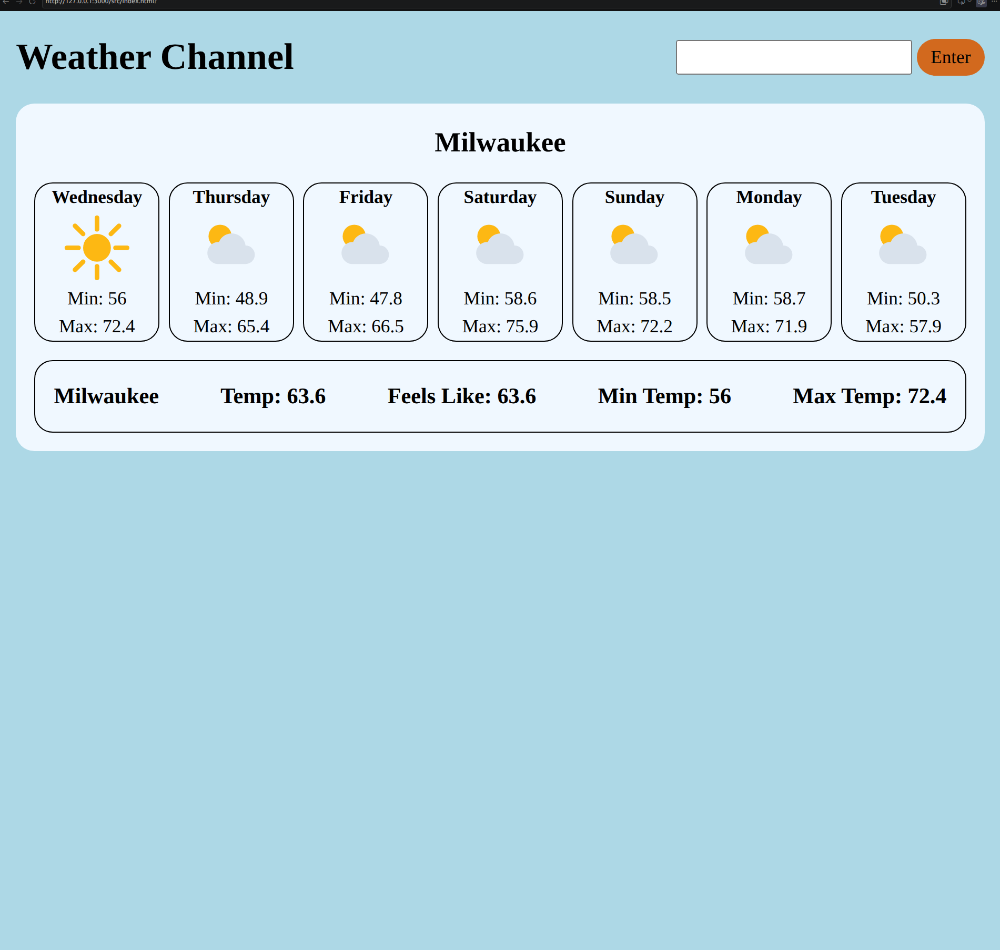
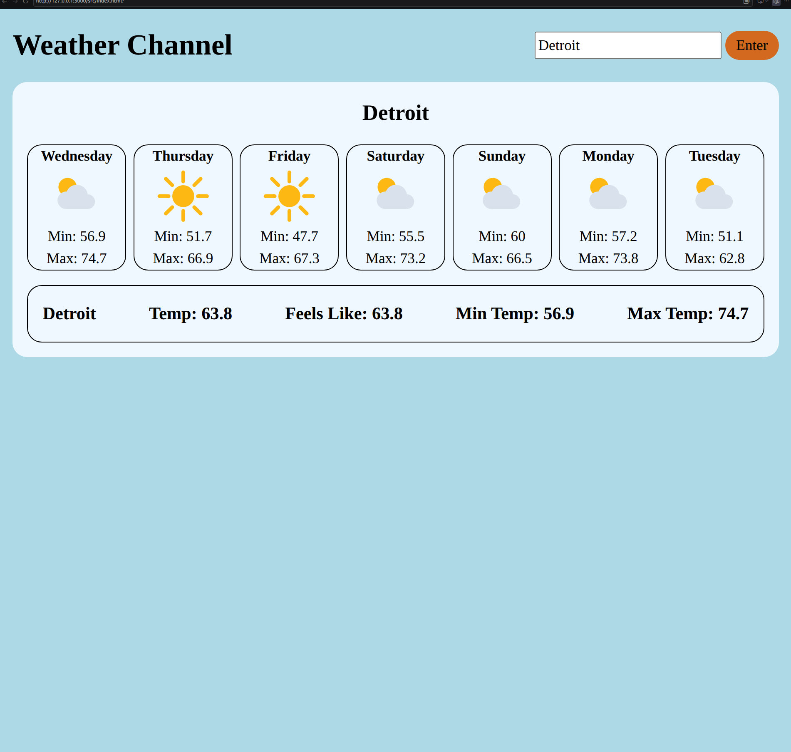

# Weather App
For this project I made a weather app with the visual crossing weather api. The goal was to use async and await which I had just learned in order to make sure the data is received before anything is processed.

## Issues & Lessons Learned
When making the two data structure variables to hold the data. I was making them outside the function that I was using await for the data. This caused the items to return undefined because they were running before the fetch data had been retrieved.

